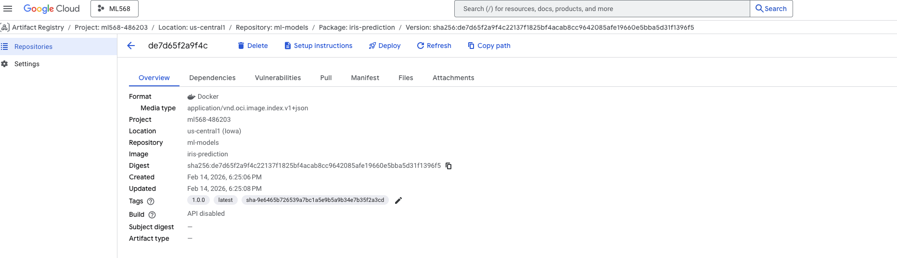

# Iris Prediction Service (Milestone 2)

[](https://github.com/ZifengC/Milestone2/actions/workflows/build.yml)

Production-style ML inference service for Iris class prediction with:
- Multi-stage Docker build
- Automated GitHub Actions CI/CD (test, build, publish)
- Image publishing to container registry with semantic tags


## Deliverables Mapping (Milestone 2)

ml-service/
├── .github/
│   └── workflows/
│       └── build.yml           # Docker build & push workflow
├── app/                        # Application code (from M1's src/)
│   ├── __init__.py
│   ├── main.py                 # FastAPI entrypoint
│   └── model.joblib            # Request/response models
├── tests/
│   └── test_app.py
├── scripts/
│   └── train_model.py
├── .dockerignore               # NEW: Exclude files from Docker build
├── .gitignore                  # Already covered in M1
├── Dockerfile                  # NEW: Container definition
├── README.md                   # Add CI badge (see below)
├── RUNBOOK.md                  # NEW: Operations documentation
└── requirements.txt


## Quick Start (Local Development)

Start the service locally:

```bash
# 1) Create and activate virtual environment
python3 -m venv .venv
source .venv/bin/activate

# 2) Install dependencies
pip install -r requirements.txt

# 3) Start API server
uvicorn app.main:app --host 0.0.0.0 --port 8000
```

In a new terminal, validate the service:

```bash
curl -fsS http://127.0.0.1:8000/health
curl -X POST http://127.0.0.1:8000/predict \
  -H "Content-Type: application/json" \
  -d '{"sepal_length":5.1,"sepal_width":3.5,"petal_length":1.4,"petal_width":0.2}'
```

Run tests (optional but recommended):

```bash
source .venv/bin/activate
pip install pytest pytest-cov httpx
pytest tests -v --cov=app --cov-report=term-missing
```

## Pull and Run Published Image

Use these steps to pull and run the published Docker image.

1. Clone the repository:

```bash
git clone https://github.com/ZifengC/Milestone2.git
cd Milestone2
```

2. Set image coordinates:

```bash
export REGISTRY_HOST=<registry-host>
export PROJECT_ID=<project-id>
export REPOSITORY=<repo-name>
export IMAGE_NAME=iris-prediction
export TAG=v1.0.0
```

3. Pull image:

```bash
docker pull $REGISTRY_HOST/$PROJECT_ID/$REPOSITORY/$IMAGE_NAME:$TAG
```

4. Run container:

```bash
docker run --rm -p 8000:8000 $REGISTRY_HOST/$PROJECT_ID/$REPOSITORY/$IMAGE_NAME:$TAG
```

5. Verify container is healthy:

```bash
curl -fsS http://127.0.0.1:8000/health
```

6. Test prediction endpoint:

```bash
curl -X POST http://127.0.0.1:8000/predict \
  -H "Content-Type: application/json" \
  -d '{"sepal_length":5.1,"sepal_width":3.5,"petal_length":1.4,"petal_width":0.2}'
```

## Registry Verification

Successful image push to registry (example evidence):



## CI/CD Summary

Workflow file: `.github/workflows/build.yml`

- `test`: runs `pytest`
- `docker-smoke-test`: builds image and verifies `/health`
- `build-and-push`: authenticates to registry and publishes image tags

## Semantic Versioning

Use `vX.Y.Z` tags for release images:

```bash
git tag v1.0.0
git push origin v1.0.0
```
